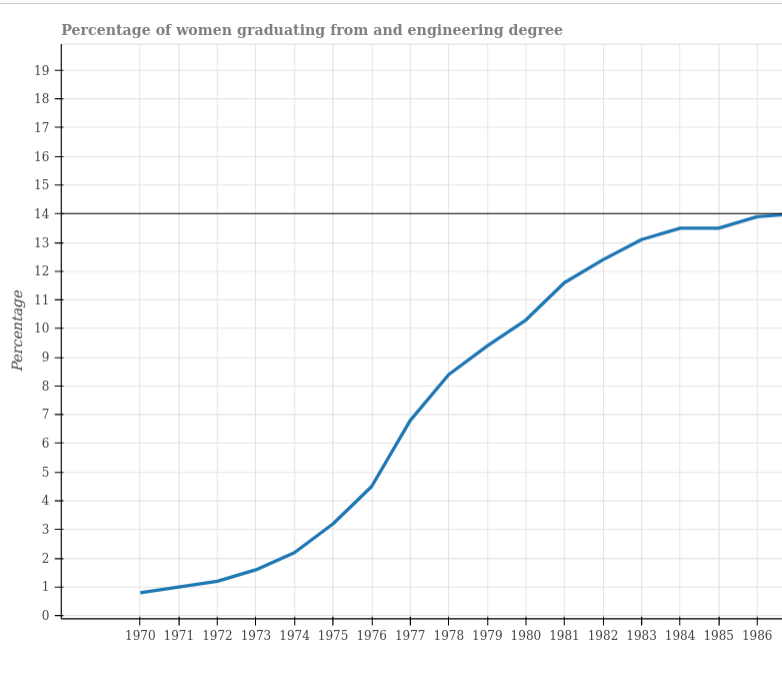

<h2>Python Data Visualization Project</h2>


<p float="left">
    <p>This project creates a html graph with Python Bokeh library.<br>
    It uses data from university statistics in form of a csv file <br>
    I use Pandas package to get the relevant data from file <br>
    and bokeh to draw the graph with options relevant for me.
    <br>Project uses: python, pandas, bokeh, docker</p>	
    
</p>

 


`code`
```python
import pandas
from bokeh.io import output_file,show
from bokeh.plotting import figure

df = pandas.read_csv("bachelors.csv")

output_file("Graph.html")

fig=figure(tools=["crosshair"],sizing_mode="stretch_width")
fig.title.text="Percentage of women graduating from an engineering degree"
fig.title.text_color="Gray"
fig.title.text_font="times"
fig.title.text_font_style="bold"
fig.xaxis.minor_tick_line_color=None
fig.yaxis.minor_tick_line_color=None
fig.xaxis.axis_label="Date"
fig.yaxis.axis_label="Percentage"
fig.xaxis.ticker = list(df["Year"])
fig.yaxis.ticker = list(range(0,22))
fig.line(df["Year"],df["Engineering"],line_width=3)

show(fig)


```